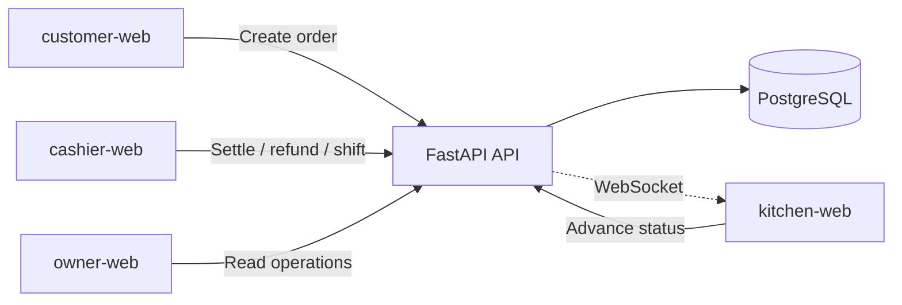

# SweetOps 🍩


## 1. Project Overview

**SweetOps is a store-scoped restaurant operations system for small food businesses.**

It brings the day-to-day operational surfaces of a multi-store food-and-beverage
business into a single system: QR table ordering, the kitchen order flow, cashier
payment and refund operations, cashier shift open/close, a controlled order-issue
and refund workflow, the inventory lifecycle with store-scoped stock, stock
transfers, physical stock counts, threshold alerts, and owner operational
visibility. Customer- and staff-facing copy is delivered in Turkish.

SweetOps started as a QR-ordering and analytics demo. It has since grown into an
operational product, and this README reflects that current state. Demand
forecasting and the analytics pipeline are **not** the center of the product;
they remain as legacy/post-MVP concerns (see the roadmap).

### Türkçe Özet

SweetOps, çok şubeli küçük yiyecek-içecek işletmeleri için QR sipariş, mutfak,
kasa, stok, vardiya ve yönetici operasyon ekranlarını bir araya getiren operasyon
yönetim sistemidir.

### Core Technologies

- **FastAPI** + **SQLAlchemy** + **Alembic** (backend & migrations)
- **PostgreSQL** (operational database)
- **Next.js** + **TypeScript** + **Tailwind CSS** (four frontend apps)
- **WebSockets** (real-time kitchen updates)
- **Docker** / **Docker Compose** (local orchestration)

---

## 2. What SweetOps Does

SweetOps runs the operational loop of a small, potentially multi-store food
business:

- A customer scans a QR code at a table, browses the menu, and places an order.
- The order flows to the kitchen, which advances it through its preparation
  lifecycle in real time.
- The cashier settles payment against the table/order, records allocations, and
  can process controlled refunds.
- Staff open and close cashier shifts, producing an auditable shift record.
- When something goes wrong with an order, staff raise an **order issue** and
  resolve it through a controlled refund workflow.
- Inventory is tracked per store across its full lifecycle — receipts,
  reservation and consumption, waste, manual adjustments, transfers between
  stores, physical stock counts, and threshold alerts.
- Owners get operational visibility across inventory, kitchen, order issues, and
  shifts.

All staff-facing and customer-facing copy is in Turkish.

---

## 3. Current Product Modules

These modules are implemented in the repository today:

| Module | Description |
| --- | --- |
| Secure QR table context | Signed table QR tokens resolve to a scoped ordering context |
| Customer order creation | Customers create orders from the resolved table context |
| Customer order idempotency | Duplicate submissions are de-duplicated safely |
| Kitchen order lifecycle | Orders advance through status transitions with real-time updates |
| Staff authentication | Cookie-based staff login/session management |
| Role-based access control | Endpoints are gated by staff role |
| Payment settlement ledger | Settlements recorded against orders/tables |
| Payment allocations | Payments allocated across order lines |
| Payment refunds | Refunds issued against allocations |
| Order issue & controlled refund workflow | Staff raise and resolve order issues with bounded refunds |
| Cashier shift opening and closing | Auditable shift open/close records |
| Store-scoped inventory | Stock is scoped per store |
| Inventory reservation & consumption lifecycle | Stock is reserved and consumed as orders progress |
| Inventory transfer workflow | Stock moves between stores with a receipt trail |
| Physical stock count workflow | Counted stock reconciled against system stock |
| Inventory threshold alerts | Low-stock thresholds surface alerts |
| Owner inventory UI | Owner-facing inventory management screens |
| Owner issue history | Owner view of order-issue history |
| Turkish user-facing copy | Customer and staff UX in Turkish |
| Read-only reconciliation scripts | Payments, inventory, and order-issue reconciliation |

---

## 4. App Surfaces

SweetOps is a monorepo with four Next.js frontends and one FastAPI backend.

| Surface | Path | Dev port | Purpose |
| --- | --- | --- | --- |
| `customer-web` | `apps/customer-web` | 3001 | QR menu browsing, order creation, order-success confirmation |
| `kitchen-web` | `apps/kitchen-web` | 3002 | Real-time kitchen order feed and status transitions |
| `cashier-web` | `apps/cashier-web` | 3004 | Payment settlement, refunds, and cashier shift open/close |
| `owner-web` | `apps/owner-web` | 3003 | Owner operational visibility: inventory, kitchen, order issues, shifts |
| `apps/api` | `apps/api` | 8000 | FastAPI backend serving all four apps |

`owner-web` exposes these routes: dashboard (`/`), inventory (`/inventory`),
kitchen (`/kitchen`), order issues (`/order-issues`), and shifts (`/shifts`).

---

## 5. Architecture Overview



The backend is a single FastAPI service backed by PostgreSQL. Schema changes are
managed with Alembic migrations. The kitchen surface receives real-time updates
over WebSockets. Each frontend is an independent Next.js app that talks to the
same API.

---

## 6. Backend Capabilities

The FastAPI service (`apps/api`) mounts the following routers:

- **Auth** (`/auth`) — staff login, session (`/me`), logout, logout-all.
- **Public menu** (`/public/menu`) — customer-facing menu.
- **Public QR context** (`/public/qr-context`) — resolve a signed table token.
- **Public orders** (`/public/orders`) — customer order creation (idempotent).
- **Kitchen orders** (`/kitchen/orders`) — kitchen dashboard and status updates.
- **Cashier** (`/cashier`) — open tables, order/table bills, settlements,
  allocations, refunds, and cashier shifts (open, current, list, close).
- **Order issues** — raise, resolve, and list order issues and their refunds.
- **Inventory** (`/inventory`) — stock, movements, purchase receipts, manual
  adjustments, waste, transfers, physical stock counts, and threshold alerts.
- **Owner analytics / insights / metrics / payments** (`/owner…`) — operational
  read views, daily metrics, payment summaries, and owner decisions.
- **WebSockets** — real-time channel used by the kitchen surface.

> **Note on analytics/forecasting endpoints:** a legacy `ingredient-forecast`
> read endpoint and related analytics views remain under `/owner`. These are
> retained as legacy/post-MVP surfaces and are **not** the product center. See
> the roadmap for how forecasting is scoped.

---

## 7. Frontend Applications

- **customer-web** — the guest experience. Resolves the QR table context, renders
  the menu, and submits orders, ending on a success confirmation.
- **kitchen-web** — the kitchen display. Streams the live order feed and drives
  status transitions.
- **cashier-web** — the cashier station. Handles bills, payment settlement,
  refunds, and shift open/close.
- **owner-web** — the owner console. Provides operational visibility across
  inventory, kitchen, order issues, and shifts.

All four apps are Next.js + TypeScript + Tailwind and share the workspace
packages under `packages/`.

---

## 8. Database and Migration Notes

- PostgreSQL is the single operational database.
- Schema is managed with **Alembic**; migration revisions live in
  `apps/api/alembic/versions/`.
- The migration history is maintained as a **single head**. See
  [docs/ALEMBIC_SINGLE_HEAD_RESOLUTION.md](docs/ALEMBIC_SINGLE_HEAD_RESOLUTION.md)
  for how divergent heads were reconciled.
- Core tables include stores, tables and QR tokens, users/roles/sessions,
  products, orders and order items, ingredients and store-scoped ingredient
  stock, payment settlements/allocations/refunds, cashier shifts, order issues,
  inventory transfers, stock counts, thresholds, and audit logs.

---

## 9. Security and Authorization Model

- **Staff authentication** is cookie-based; sessions are tracked server-side and
  can be revoked (`logout`, `logout-all`).
- **Role-based access control** gates staff endpoints by role.
- **CORS** uses an explicit, credentialed allow-list (never `*`); staff and
  public origins are supplied via configuration
  (`STAFF_TRUSTED_ORIGINS` / `PUBLIC_TRUSTED_ORIGINS`).
- **QR table tokens** are signed so a table context cannot be forged.

See [docs/STAFF_AUTH_RBAC.md](docs/STAFF_AUTH_RBAC.md) and
[docs/SECURE_QR_TABLE_CONTEXT.md](docs/SECURE_QR_TABLE_CONTEXT.md).

---

## 10. Inventory and Payment Integrity

- **Payments** are recorded as a settlement ledger with allocations and refunds,
  so amounts reconcile against orders. Refunds — including those driven by the
  order-issue workflow — are bounded and traceable.
- **Inventory** tracks the full lifecycle: reservation and consumption tied to
  order progress, plus receipts, waste, manual adjustments, transfers, and
  physical counts. Threshold alerts surface low stock.
- **Reconciliation scripts** (`scripts/reconcile_payments.py`,
  `scripts/reconcile_inventory.py`, `scripts/reconcile_order_issues.py`) provide
  read-only integrity checks.

See [docs/PAYMENT_SETTLEMENT_WORKFLOW.md](docs/PAYMENT_SETTLEMENT_WORKFLOW.md),
[docs/INVENTORY_LIFECYCLE.md](docs/INVENTORY_LIFECYCLE.md), and
[docs/ORDER_ISSUE_REFUND_WORKFLOW.md](docs/ORDER_ISSUE_REFUND_WORKFLOW.md).

---

## 11. Turkish UX Scope

All customer-facing and staff-facing copy is delivered in Turkish. This covers
the menu, ordering, kitchen, cashier, shift, order-issue, and owner surfaces.
The scope and conventions are documented in
[docs/TURKISH_USER_FACING_LOCALIZATION.md](docs/TURKISH_USER_FACING_LOCALIZATION.md).

---

## 12. Local Development Setup

**Prerequisites:** Docker + Docker Compose, Node.js (with npm workspaces), and
Python (for the API and scripts).

1. Start the backend stack (API + PostgreSQL):

   ```bash
   docker-compose up -d
   ```

2. Install frontend workspace dependencies from the repo root:

   ```bash
   npm install
   ```

3. Start the frontends (each in its own terminal):

   ```bash
   npm run dev:customer   # customer-web  -> http://localhost:3001
   npm run dev:kitchen    # kitchen-web   -> http://localhost:3002
   npm run dev:owner      # owner-web     -> http://localhost:3003
   npm run dev:cashier    # cashier-web   -> http://localhost:3004
   ```

---

## 13. Useful Commands

```bash
# Frontends (from repo root)
npm run dev:customer      # customer-web on :3001
npm run dev:kitchen       # kitchen-web  on :3002
npm run dev:owner         # owner-web    on :3003
npm run dev:cashier       # cashier-web  on :3004
npm run build:types       # build @sweetops/types
npm run build:ui          # build @sweetops/ui

# Backend / infra
docker-compose up -d      # start API + PostgreSQL

# Operational tooling / staff management
python scripts/manage_staff_users.py
python scripts/manage_qr_tokens.py

# Read-only reconciliation
python scripts/reconcile_payments.py
python scripts/reconcile_inventory.py
python scripts/reconcile_order_issues.py
```

---

## 14. Testing and Verification

- Backend tests use **pytest** (`apps/api`). The current test baseline is
  documented in [docs/TEST_SUITE_BASELINE.md](docs/TEST_SUITE_BASELINE.md).
- Reconciliation scripts under `scripts/` provide read-only integrity checks for
  payments, inventory, and order issues.

Run the API test suite from `apps/api`:

```bash
cd apps/api && pytest
```

---

## 15. Documentation Index

Workflow and subsystem documentation lives in `docs/`:

- [docs/ORDER_ISSUE_REFUND_WORKFLOW.md](docs/ORDER_ISSUE_REFUND_WORKFLOW.md)
- [docs/CASHIER_SHIFT_CLOSING.md](docs/CASHIER_SHIFT_CLOSING.md)
- [docs/PAYMENT_SETTLEMENT_WORKFLOW.md](docs/PAYMENT_SETTLEMENT_WORKFLOW.md)
- [docs/INVENTORY_LIFECYCLE.md](docs/INVENTORY_LIFECYCLE.md)
- [docs/STORE_SCOPED_INVENTORY.md](docs/STORE_SCOPED_INVENTORY.md)
- [docs/INVENTORY_TRANSFER_WORKFLOW.md](docs/INVENTORY_TRANSFER_WORKFLOW.md)
- [docs/PHYSICAL_STOCK_COUNT_WORKFLOW.md](docs/PHYSICAL_STOCK_COUNT_WORKFLOW.md)
- [docs/INVENTORY_THRESHOLD_ALERTS.md](docs/INVENTORY_THRESHOLD_ALERTS.md)
- [docs/OWNER_INVENTORY_MANAGEMENT_UI.md](docs/OWNER_INVENTORY_MANAGEMENT_UI.md)
- [docs/SECURE_QR_TABLE_CONTEXT.md](docs/SECURE_QR_TABLE_CONTEXT.md)
- [docs/CUSTOMER_ORDER_IDEMPOTENCY.md](docs/CUSTOMER_ORDER_IDEMPOTENCY.md)
- [docs/STAFF_AUTH_RBAC.md](docs/STAFF_AUTH_RBAC.md)
- [docs/TURKISH_USER_FACING_LOCALIZATION.md](docs/TURKISH_USER_FACING_LOCALIZATION.md)
- [docs/ALEMBIC_SINGLE_HEAD_RESOLUTION.md](docs/ALEMBIC_SINGLE_HEAD_RESOLUTION.md)
- [docs/TEST_SUITE_BASELINE.md](docs/TEST_SUITE_BASELINE.md)
- [docs/PROJECT_ROADMAP.md](docs/PROJECT_ROADMAP.md)

Additional reference material lives under `docs/api/`, `docs/architecture/`,
`docs/product/`, and `docs/demo/`.

---

## 16. Current MVP Scope

The current MVP is the operational core described above: QR ordering, kitchen
flow, cashier payments/refunds, cashier shifts, order-issue and controlled refund
workflow, store-scoped inventory with its full lifecycle, and owner operational
visibility — all with Turkish UX.

---

## 17. Post-MVP Roadmap

A full breakdown lives in [docs/PROJECT_ROADMAP.md](docs/PROJECT_ROADMAP.md).
In short:

- **Near-term MVP completion:** kitchen preparation timing metrics, an owner
  operational dashboard, seed demo/sample data, and production-readiness
  hardening.
- **Post-MVP backlog:** forecasting, supplier management, purchase orders,
  automatic reorder, scheduled alerts, barcode, lot/expiry tracking, customer
  wallet, coupons/store credit, delivery integration, bank reconciliation,
  accounting export, chargeback workflow, POS hardware integration, and a mobile
  app.

**Forecasting is intentionally deferred until enough reliable operational data
exists.** It is not part of the remaining MVP branch plan.

---

## 18. Explicitly Out of Scope

For now, SweetOps deliberately does **not** include:

- demand forecasting as an active feature (deferred; legacy views only),
- supplier management,
- purchase orders,
- automatic reorder,
- POS hardware integration,
- a mobile app,
- delivery / accounting / bank integrations.

These are tracked in the post-MVP backlog, not the current build.

---

## 19. Repository Status

SweetOps is a serious, portfolio-grade operational system. Every capability
described in this README maps to code in the repository. Demand forecasting and
the older analytics pipeline remain as legacy/post-MVP references and are not
presented as the current product center.
