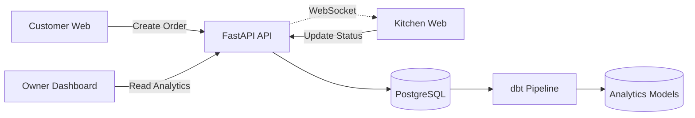

# SweetOps 🍩


## 1️⃣ Project Overview

SweetOps is a modern, data-driven, full-stack restaurant operations platform. 
Instead of traditional Point of Sale (POS) tools, SweetOps treats every transaction as a real-time event and instantly routes it into a Data Engineering pipeline. 

This system elegantly simulates the complete lifecycle workflow:
**Customer → Order → Kitchen → Analytics → Forecast**

### Core Technologies
- **FastAPI**
- **PostgreSQL**
- **dbt** (Data Build Tool)
- **WebSockets**
- **Next.js**
- **TypeScript**
- **Docker**

---

## 2️⃣ Architecture



---

## Event Driven Data Flow

SweetOps mimarisi klasik POS sistemlerinden farklıdır.

Her sipariş bir event olarak ele alınır ve şu pipeline'a girer:

**Customer Order**  
→ **Operational DB** (PostgreSQL)  
→ **dbt Transformations**  
→ **Analytics Tables**  
→ **Owner Dashboard**  
→ **Forecast Models**

Bu yaklaşım sayesinde sistem yalnızca operasyon sağlamakla kalmaz, aynı zamanda değer katan, analiz edilebilir bir veri ekosistemi üretir.

---

## 3️⃣ Tech Stack

**Backend**
- FastAPI
- SQLAlchemy
- Alembic
- WebSockets

**Data**
- PostgreSQL
- dbt

**Frontend**
- Next.js
- TypeScript
- Tailwind CSS
- Recharts

**Infrastructure**
- Docker
- Docker Compose

---

## 4️⃣ Monorepo Structure

```text
SweetOps/
├── apps/
│   ├── api/             
│   ├── customer-web/    
│   ├── kitchen-web/     
│   └── owner-web/       
├── data/
│   └── dbt/             
├── packages/
│   ├── types/           
│   └── ui/              
├── scripts/
│   └── demo_seed.py 
├── docs/ 
└── docker-compose.yml   
```

---

## 5️⃣ Screenshots

### Customer Menu


### Order Success


### Kitchen Order (NEW)


### Kitchen Order (IN PREP)


### Owner Dashboard


### Forecast Panel


---

## 6️⃣ Features

**Customer Interface**
- menu browsing
- ingredient customization
- order creation

**Kitchen Display**
- real-time order feed
- WebSocket updates
- status transitions

**Owner Analytics**
- revenue
- average order value
- top ingredients
- hourly demand

**Forecast Layer**
- Forecast modelleri dbt SQL modelleri olarak yazılmıştır
- Rolling 7 day moving average kullanılır
- Amaç ML değil analytics pipeline (veri hazırlık katmanı) göstermektir
- Ingredient demand (malzeme talebi) tahmini yapılır
- Trend direction (yön) ve confidence level (güven düzeyi) hesaplanır

---

## 7️⃣ Demo Flow

To run the local ecosystem and generate the mock history:

1. Start the cluster:
   ```bash
   docker-compose up -d
   ```

2. Seed historical database (14-day history for analytics):
   ```bash
   docker-compose run --rm -v "${PWD}/scripts:/scripts" api python /scripts/demo_seed.py
   ```

3. Run dbt to build analytics and forecast models:
   ```bash
   docker-compose run --rm dbt dbt run
   ```

4. Start the frontends simultaneously (in separate terminals or using Turborepo):
   ```bash
   cd apps/customer-web && npm run dev
   cd apps/kitchen-web && npm run dev
   cd apps/owner-web && npm run dev
   ```

---

---

## Why This Project Exists

SweetOps was built as a portfolio project to demonstrate how modern backend engineering and data engineering can work together.

Instead of building a simple dashboard, the goal was to show a **complete operational data system** including:

- transactional backend
- real-time WebSocket communication
- analytics pipelines
- demand forecasting layer
- multi-app frontend architecture

---

## Türkçe Açıklama

SweetOps, restoran operasyonlarını ve veri analitiğini aynı sistem içinde birleştiren modern bir demo platformudur.

Proje klasik bir POS sistemi gibi çalışmak yerine her siparişi bir **veri olayı (event)** olarak ele alır.

Bu olaylar aşağıdaki veri hattından geçer:

**Müşteri Siparişi**  
→ **Operasyonel Veritabanı** (PostgreSQL)  
→ **dbt ile Veri Dönüşümleri**  
→ **Analitik Tablolar**  
→ **Yönetim Paneli** (Owner Dashboard)  
→ **Talep Tahmin Modelleri** (Forecast Layer)

Projenin amacı yalnızca bir arayüz oluşturmak değil; aynı zamanda aşağıdaki modern yazılım mimarilerini tek bir projede göstermektir:

- Backend API mimarisi (FastAPI)
- Gerçek zamanlı sistemler (WebSocket)
- Veri mühendisliği pipeline'ı (dbt)
- Analitik veri modelleme
- Basit talep tahmini (Rolling Average Forecast)
- Çok uygulamalı frontend mimarisi (Customer / Kitchen / Owner)

SweetOps bu yönüyle hem **Backend Engineering** hem de **Data Engineering** disiplinlerini bir araya getiren portföy niteliğinde bir projedir.

---

## Future Improvements

- ML based demand forecasting
- Redis backed WebSocket scaling
- Multi-store architecture
- Authentication & RBAC
- Production deployment (Kubernetes)
