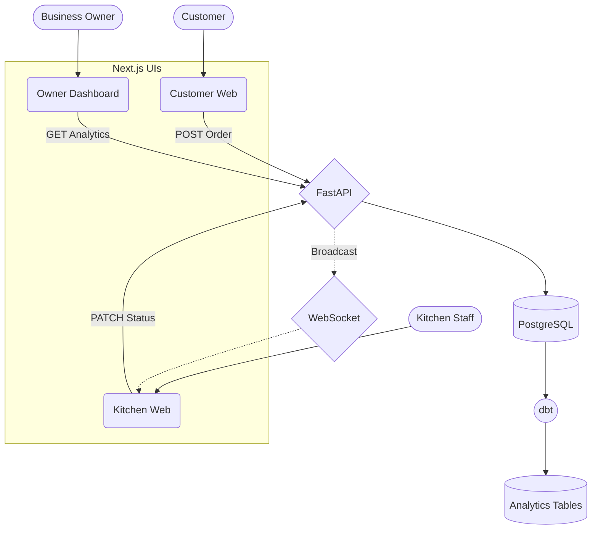
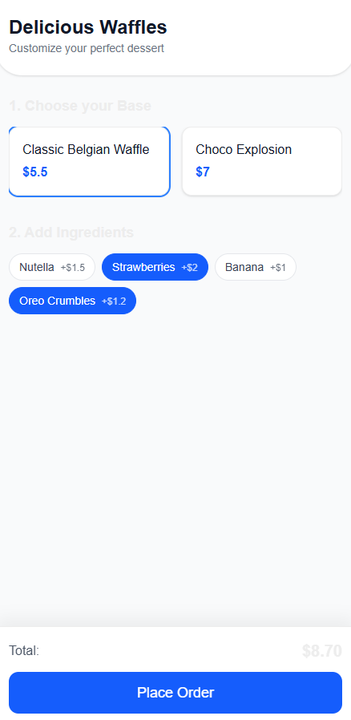
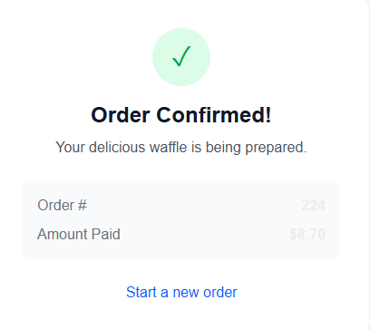
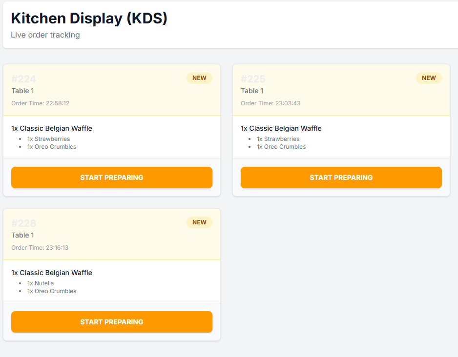
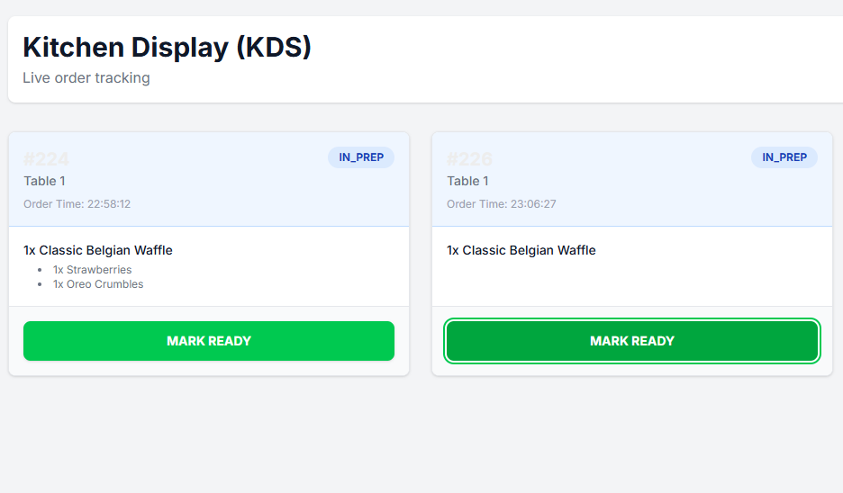
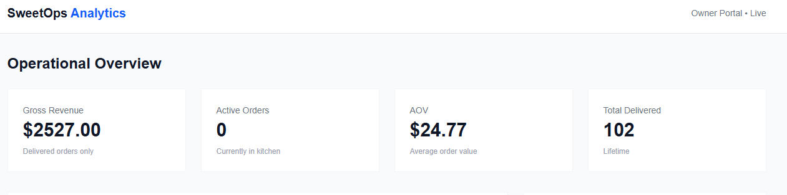
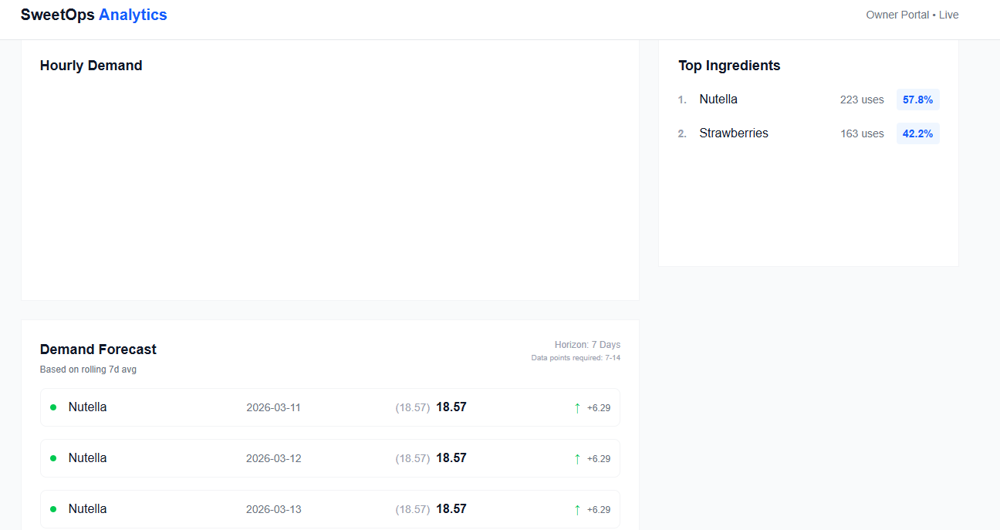

# SweetOps 🍩

## 1️⃣ Project Overview

SweetOps is a modern, data-driven, full-stack restaurant operations platform. 
Instead of traditional Point of Sale (POS) tools, SweetOps treats every transaction as a real-time event and instantly routes it into a Data Engineering pipeline. 

This system elegantly simulates the complete lifecycle workflow:
**Customer → Order → Kitchen → Analytics → Forecast**

### Core Technologies
- **FastAPI**
- **PostgreSQL**
- **dbt** (Data Build Tool)
- **WebSockets**
- **Next.js**
- **TypeScript**
- **Docker**

---

## 2️⃣ Architecture



---

## 3️⃣ Tech Stack

**Backend**
- FastAPI
- SQLAlchemy
- Alembic
- WebSockets

**Data**
- PostgreSQL
- dbt

**Frontend**
- Next.js
- TypeScript
- Tailwind CSS
- Recharts

**Infrastructure**
- Docker
- Docker Compose

---

## 4️⃣ Monorepo Structure

```text
SweetOps/
├── apps/
│   ├── api/             
│   ├── customer-web/    
│   ├── kitchen-web/     
│   └── owner-web/       
├── data/
│   └── dbt/             
├── packages/
│   ├── types/           
│   └── ui/              
├── scripts/
│   └── demo_seed.py 
├── docs/ 
└── docker-compose.yml   
```

---

## 5️⃣ Screenshots

### Customer Menu


### Order Success


### Kitchen Order (NEW)


### Kitchen Order (IN PREP)


### Owner Dashboard


### Forecast Panel


---

## 6️⃣ Features

**Customer Interface**
- menu browsing
- ingredient customization
- order creation

**Kitchen Display**
- real-time order feed
- WebSocket updates
- status transitions

**Owner Analytics**
- revenue
- average order value
- top ingredients
- hourly demand

**Forecast Layer**
- dbt ile oluşturulan rolling 7 day average demand forecasting modeli.

---

## 7️⃣ Demo Flow

To run the local ecosystem and generate the mock history:

1. Start the cluster:
   ```bash
   docker-compose up -d
   ```

2. Seed historical database (14-day history for analytics):
   ```bash
   docker-compose run --rm -v "${PWD}/scripts:/scripts" api python /scripts/demo_seed.py
   ```

3. Run dbt to build analytics and forecast models:
   ```bash
   docker-compose run --rm dbt dbt run
   ```

4. Start the frontends simultaneously (in separate terminals or using Turborepo):
   ```bash
   cd apps/customer-web && npm run dev
   cd apps/kitchen-web && npm run dev
   cd apps/owner-web && npm run dev
   ```

---

## 8️⃣ Türkçe Açıklama

Bu sistem:
- sipariş operasyonu
- mutfak ekranı
- gerçek zamanlı WebSocket güncellemeleri
- dbt ile analitik pipeline
- talep tahmin modeli

gibi bileşenleri tek bir mimaride birleştiren bir demo platformudur. 

**Amaç:**
Modern veri mühendisliği ve backend mimarisini tek projede göstermek.
